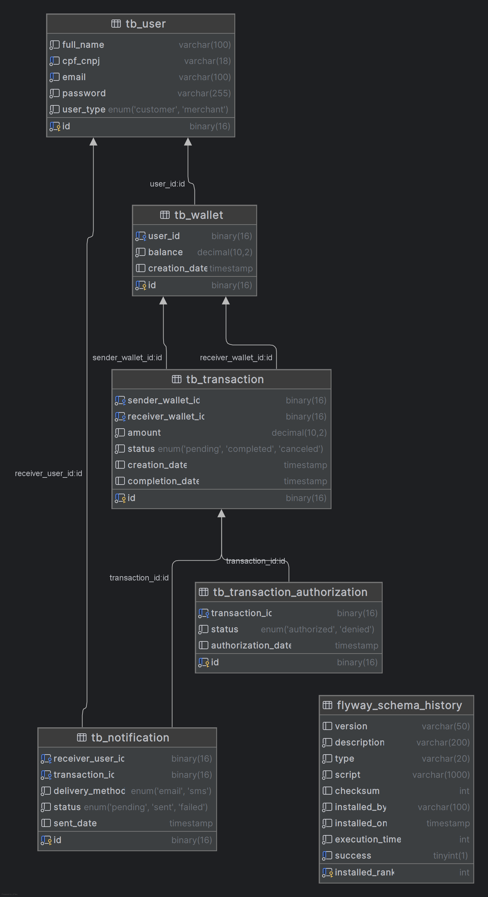

    

 

  
  
  
  
  
  
  

  ## Desafio Backend do PicPay
  

  Confira o enunciado completo, [clicando aqui](./problem.md).

  ## Arquitetura
  
  
  ### Modelo de banco de dados
  

##  Pré -requisitos

- [ `Java 21+` ](https://www.oracle.com/java/technologies/downloads/#java21)
- [ `Apache Maven`](https://maven.apache.org/download.cgi)
- [ `Docker` ](https://www.docker.com/)
- [ `Docker-Compose` ](https://docs.docker.com/compose/install/)

## Implementações Frameworks

* [Spring Framework](./SpringFramework)
* [Quarkus](./Quarkus)
* [Micronaut](./Micornaut)
* [Open Liberty](./OpenLiberty)
* [Java Puro](./PureJava)

 

 
<b>Developed by Wesley Oliveira Santos</b>
